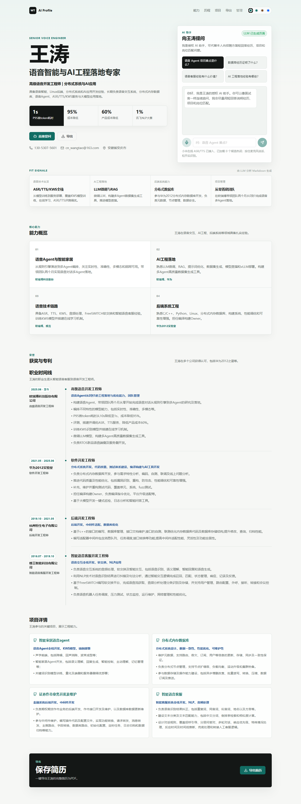
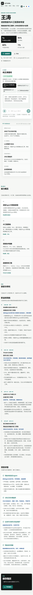
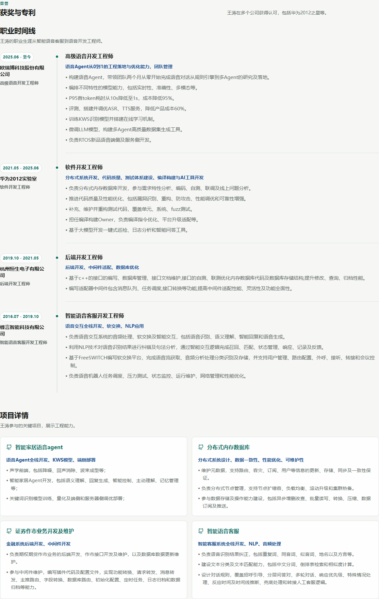

# AI Profile Page

一个面向招聘方和面试官的 AI 个人能力介绍页。项目把 Markdown 简历资料、首页编排、AI 问答、语音交互和 JD 匹配导出整合成一个可部署的个人展示系统。

访客可以直接浏览候选人的核心能力、经历证据和代表项目，也可以像面试官一样连续提问。后台用于维护事实资料、调整首页展示、切换视觉风格、配置简历导出策略，并管理语音复刻参考音色。

## 预览







## 功能特性

- Markdown 驱动的个人资料库，内容源位于 `content/profile.md`。
- 招聘方视角的多轮 AI 问答，回答会代替简历主人公面向访客表达。
- 首页 briefing 可由 LLM 基于资料生成，也可在后台人工编排保存。
- 支持 Markdown 渲染的聊天消息，避免把 `*`、列表等 Markdown 字符裸露给访客。
- 小米 MiMo ASR/TTS 接入，支持按住说话、松开识别、语音回复。
- ASR 热词抽取与纠错，强化中英文混合词、项目名、技术名词识别。
- 小米声纹复刻参考音色：后台录制或上传参考音频，首页 TTS 可使用参考音色。
- JD 匹配简历导出，支持 ATS 一页纸、两页精简和完整匹配版等篇幅策略。
- 简历样式模板可由管理台配置，内置 ATS 单栏、现代侧栏、时间线、技术档案和紧凑摘要等风格。
- 管理员可上传简历头像，支持头像的导出模板会自动内嵌图片。
- 导出简历页脚可展示开源项目 GitHub 地址和作者署名。
- 管理员可动态选择页面视觉风格预设。
- 展示项目模式：可免验证体验后台生成和预览，但保存动作会被后端拦截。

## 技术栈

| 层级 | 技术 |
| --- | --- |
| 前端 | Vue 3, Vite, Naive UI, Lucide Icons |
| 后端 | FastAPI, Pydantic Settings, HTTPX |
| 内容 | Markdown, JSON 配置 |
| AI | DeepSeek Chat API |
| 语音 | Xiaomi MiMo ASR/TTS, voice clone reference audio |
| 导入导出 | python-docx, pypdf, markdown-to-html resume rendering |

## 项目结构

```text
ai-profile-page/
├── backend/                 # FastAPI API 服务
│   ├── app/
│   ├── .env.example
│   └── requirements.txt
├── content/                 # 可维护内容与配置
│   ├── profile.md
│   ├── home_briefing.json
│   ├── site_style.json
│   └── resume_export_config.json
├── docs/
│   └── screenshots/         # README 预览截图
├── frontend/                # Vue/Vite 前端
│   └── src/
└── README.md
```

## 本地运行

### 1. 启动后端

```powershell
cd backend
python -m venv .venv
.\.venv\Scripts\Activate.ps1
pip install -r requirements.txt
Copy-Item .env.example .env
uvicorn app.main:app --reload --host 127.0.0.1 --port 8000
```

### 2. 启动前端

```powershell
cd frontend
npm install
npm run dev
```

访问 [http://127.0.0.1:4173](http://127.0.0.1:4173)。

## 环境变量

后端读取 `backend/.env`。请从 `backend/.env.example` 复制后再填写真实配置，真实 `.env` 不应进入 Git。

| 变量 | 说明 |
| --- | --- |
| `DEEPSEEK_API_KEY` | DeepSeek API Key。为空时 AI 问答和导出会降级为本地保守结果。 |
| `DEEPSEEK_BASE_URL` | DeepSeek API 地址。 |
| `DEEPSEEK_CHAT_MODEL` | 首页问答、后台编辑使用的模型。 |
| `DEEPSEEK_EXPORT_MODEL` | JD 简历导出使用的模型。 |
| `ADMIN_PASSWORD` | 后台管理密码，生产环境必须改成强密码。 |
| `SHOWCASE_MODE` | 设为 `true` 后后台免验证，但保存会失败，适合公开演示。 |
| `FRONTEND_ORIGIN` | 前端源，用于 CORS。 |
| `STATIC_DIR` | 生产环境中由 FastAPI 托管前端静态文件时使用。 |
| `XIAOMI_MIMO_API_KEY` | 小米 MiMo 语音 API Key。 |
| `XIAOMI_MIMO_ASR_MODEL` | ASR 模型名。 |
| `XIAOMI_MIMO_TTS_MODEL` | TTS 模型名。 |
| `XIAOMI_MIMO_TTS_VOICECLONE_MODEL` | 声纹复刻 TTS 模型名。 |
| `VOICE_CLONE_REFERENCE_PATH` | 后台保存参考音色的路径。 |

## 内容维护

- 事实资料：编辑 `content/profile.md`，或进入 `/admin` 使用 Markdown 工作台。
- 首页编排：编辑 `content/home_briefing.json`，或在后台通过“首页编排”生成和预览。
- 视觉风格：编辑 `content/site_style.json`，或在后台选择风格预设。
- 简历导出策略：编辑 `content/resume_export_config.json`，或在后台调整一页纸/两页版内容预算、样式模板、头像开关和开源署名。
- 简历头像：后台上传 JPG、PNG 或 WebP，文件保存到 `storage/`，导出 HTML 时按模板配置内嵌。

后台保存会刷新资料索引。AI 生成内容仍应人工确认后再保存，系统提示词会约束模型不新增资料中没有的事实。

## 展示项目模式

设置：

```env
SHOWCASE_MODE=true
```

效果：

- `/admin` 免管理密码进入。
- 可体验导入、AI 生成、首页编排、风格切换、导出策略调整和参考音色录制。
- 后端会拦截写入型保存动作，并返回“展示项目模式下不会保存”的提示。
- 参考音色在展示模式下可临时保存在当前浏览器 `localStorage`，便于同一浏览器内体验首页语音复刻。

## 生产部署

推荐流程：

```powershell
cd frontend
npm run build
```

然后把 `frontend/dist` 与后端一起部署，并在后端 `.env` 中设置：

```env
STATIC_DIR=../frontend/dist
FRONTEND_ORIGIN=https://your-domain.example
```

更多部署建议见 [docs/DEPLOYMENT.md](docs/DEPLOYMENT.md)。

## 验证

```powershell
cd frontend
npm run build

cd ..\backend
.\.venv\Scripts\python.exe -m compileall app
```

## 安全说明

- 不要提交 `backend/.env`、语音参考音频、后台密码、API Key 或服务器凭据。
- 生产环境必须关闭默认管理密码，并建议接入更完整的鉴权方案。
- 公开部署时建议使用 HTTPS，否则浏览器可能限制麦克风权限。

详见 [SECURITY.md](SECURITY.md)。

## 贡献

欢迎提交 issue 和 pull request。请先阅读 [CONTRIBUTING.md](CONTRIBUTING.md)。

## License

MIT License. See [LICENSE](LICENSE).
